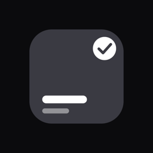

# Dayspan

**What's on today?** One dark screen that answers it: your calendar events,
your tasks and your habit tiles, together.

<br clear="left">

**English** · [Türkçe](README.tr.md)


Dayspan is for the busy person who opens their calendar all day. Instead of
one more app to maintain, it reads the calendars already on your phone and
puts today's events next to the two things a calendar cannot hold: the tasks
you must get to and the habits you are trying to keep.

No account, no cloud, no ads. Everything stays on the device. The code is
open so you can verify that yourself.

> **Status:** feature complete for 1.0, preparing the first App Store
> submission. Android builds but is not yet published.
> Website · [Support](https://voxyfy.github.io/dayspan/support.html) ·
> [Privacy](https://voxyfy.github.io/dayspan/privacy.html)

## Contents

[Why](#why) · [Features](#features) · [Design principles](#design-principles) ·
[Stack](#stack) · [Getting started](#getting-started) ·
[Project structure](#project-structure) · [Localization](#localization) ·
[Tests](#tests) · [Privacy](#privacy) · [Screenshots](#screenshots) · [Release](#release) ·
[Contributing](#contributing) · [Third-party assets](#third-party-assets) ·
[License](#license)

## Why

Calendar apps are good at meetings and bad at everything else. Task apps
drown you in lists. Habit apps live in their own world and never see your
day. The result is three apps open before breakfast.

Dayspan makes three decisions to collapse them into one screen:

1. **The calendar is read, never copied.** Your events are the source of
   truth; Dayspan shows them and gets out of the way.
2. **One board, no sections.** Tasks and habits are tiles on the same grid.
   Tasks are graphite, habits carry colour. No labels, no tabs inside the day.
3. **The day has an end.** When the last tile is done, the board says so and
   celebrates once. Then it leaves you alone.

## Features

| Status | Feature |
|---|---|
| ✅ | Today board: calendar timeline (events only, "Now" badge) above a single tile grid |
| ✅ | Tasks with optional time, duration and note; "move to tomorrow"; swipe to delete |
| ✅ | Habit tiles: daily or weekly goal, chosen weekdays, in-day count (8 glasses of water) |
| ✅ | Ten-colour tile palette, each colour with its own ink; 40+ Phosphor icons |
| ✅ | Habit page: identity card, six-month contribution heatmap in the habit's colour, current and best streak, total |
| ✅ | Finished habits turn graphite on the Today board; colour only calls the pending |
| ✅ | Reminders per task or habit: notify on time or before, or a real alarm (iOS 26 AlarmKit) |
| ✅ | Morning brief: one notification at 08:00 with the day's events, tasks and habits (off by default) |
| ✅ | Day complete: confetti from the tile colours, once per day, switchable |
| ✅ | iOS Home Screen widget (WidgetKit) fed through an App Group |
| ✅ | Four-page onboarding: promise, calendar permission, reminders, starter habits |
| ✅ | English and Turkish UI, chosen in Settings (device language is not followed) |
| ✅ | Start over: erases every habit, task and setting; language is kept |
| ✅ | Apple Watch app: today's tiles on the wrist, tap to check off; reminders mirror as notifications |
| 🔜 | Ready-made routines and richer habit statistics |

## Design principles

- **Dark first.** The app is opened between meetings, from bed, before
  sleep. Near-black ground (`#0B0B0D`), graphite surfaces, no borders.
- **Colour lives in the tile.** Ground, surfaces and text are neutral. The
  only identity-bearing colour is a tile's colour, and it paints the tile,
  the tile's icon, its week dots and its heatmap. Nothing else.
- **Accent is white.** Selection, the primary button and the "Now" badge are
  white. A coloured accent next to ten tile colours would be an eleventh.
- **Every colour has one ink.** Yellow, lime and cyan tiles are too bright for
  white text; each palette entry carries its own ink (`TileColor`).
- **Two tap targets per tile.** The circle checks it off, the rest opens the
  page. One target would turn every open into an accidental check.
- **Empty states are monochrome.** Illustrations are recoloured to white and
  greys so they do not compete with the tiles.
- **Permissions are asked in context**, never at first launch: calendar when
  you tap "Connect calendar", notifications when you turn a reminder on.

## Stack

| | |
|---|---|
| UI | Flutter 3.41 / Dart 3.11 |
| Storage | Drift (SQLite), schema v3 |
| State | Riverpod |
| Navigation | go_router with a stateful shell for the three tabs |
| Calendar | device_calendar (read-only) |
| Notifications | flutter_local_notifications, timezone |
| Alarms | AlarmKit via a small Swift bridge (`ios/Runner/AlarmBridge.swift`) |
| Widget | WidgetKit + home_widget, App Group `group.com.batuhanhaymana.dayspan` |
| Watch | SwiftUI watchOS app + WatchConnectivity bridge (`ios/Runner/WatchBridge.swift`) |
| Icons | Phosphor |
| i18n | ARB files + `flutter gen-l10n` |

## Getting started

```bash
git clone https://github.com/Voxyfy/dayspan.git
cd dayspan
flutter pub get
dart run build_runner build --delete-conflicting-outputs   # Drift code generation
flutter gen-l10n                                            # ARB → lib/l10n/app_localizations*.dart
flutter run
```

Generated files (`*.g.dart`, `app_localizations*.dart`) are not committed.
Re-run `build_runner` after any change to `lib/data/db/tables.dart` and
`gen-l10n` after any change to the ARB files.

iOS:

```bash
cd ios && pod install && cd ..
open ios/Runner.xcworkspace   # signing is configured in Xcode
```

The widget extension target is added to the Xcode project with
`ruby ios/add_widget_target.rb` (needs the `xcodeproj` gem). The script
encodes four pitfalls that cost real time: an empty `PRODUCT_NAME`, the embed
step ordering before "Thin Binary", the widget target having to inherit
`Flutter/Generated.xcconfig` (otherwise `CFBundleVersion` is empty and the
upload is rejected), and `containerBackground` requiring iOS 17 for the
widget while the app targets iOS 16.

The Watch app target is added with `ruby ios/add_watch_target.rb`. Once it
exists, `flutter build` and `flutter run` require an explicit `-d <device>`;
Flutter refuses to build a watch companion without one.

AlarmKit is linked **weak** and every call sits behind `#available(iOS 26)`;
on older systems the "Alarm" option is simply not shown.

## Project structure

```
lib/
├── core/
│   ├── router.dart            # Routes; onboarding and habit page live outside the tab shell
│   ├── providers.dart         # Riverpod providers; screens never touch the database directly
│   ├── locale.dart            # Language choice (SharedPreferences)
│   ├── notifications.dart     # Local notification service
│   ├── alarms.dart            # Dart side of the AlarmKit bridge
│   ├── widget_bridge.dart     # Writes today's JSON for the iOS widget
│   ├── watch_bridge.dart      # Sends today's board to the Watch, applies its taps
│   ├── theme/                 # Colour tokens, tile palette, metrics, theme
│   └── widgets/               # HabitTile, TaskTile, Heatmap, Confetti, EmptyState…
├── data/
│   ├── db/                    # Drift tables and DayspanDatabase
│   └── calendar/              # Read-only device calendar service
├── features/
│   ├── today/                 # Today board and task editor
│   ├── habits/                # Grid, editor, habit page, status and history logic
│   ├── reminders/             # Reminder field and scheduler
│   ├── brief/                 # Morning brief
│   ├── onboarding/            # First-launch flow
│   ├── settings/              # Settings, celebrations, start over
│   └── shell/                 # Floating icon-only tab bar
├── l10n/                      # app_en.arb, app_tr.arb
└── main.dart
ios/DayspanWidget/             # WidgetKit extension (Swift)
ios/Runner/AlarmBridge.swift   # AlarmKit bridge
ios/DayspanWatch/              # Apple Watch app (SwiftUI)
ios/Runner/WatchBridge.swift   # WatchConnectivity bridge
assets/icon/                   # App icon source (SVG) and rendered PNGs
assets/illustrations/          # unDraw SVGs, recoloured to monochrome
tool/                          # Illustration palette and screenshot flattening scripts
test/                          # Unit and widget tests (+ screenshot tool)
test/fonts/                    # Inter, used only by the screenshot tool
screenshots/                   # App Store frames by size class
docs/                          # GitHub Pages: landing, support, privacy
```

Rules the codebase follows:

- **Colour constants exist only in `lib/core/theme`.** A `Color(0x…)` in a
  screen is a bug. Tile colours come from `TilePalette`, which is only ever
  appended to; reordering would recolour existing users' tiles.
- **Screens read through providers**, never the database. Tests swap in an
  in-memory SQLite.
- **Status and history are computed in one place.** `HabitStatus` (today and
  this week) and `HabitHistory` (heatmap, streaks) are pure functions used by
  every screen, so the grid and the board can never disagree on a number.
- **Comments explain *why* and name the rejected alternative.** Identifiers
  are English; comments are Turkish, the author's working language.

## Localization

All user-facing text lives in `lib/l10n/app_en.arb` and `app_tr.arb` and is
read as `context.l10n.key`. Adding a string means adding it to both files and
running `flutter gen-l10n`.

The default language is English and the device language is deliberately
**not** followed; the user picks in Settings and the choice survives
"Start over". Contributions of new languages are welcome: copy `app_en.arb`,
translate, add the locale to `supportedLocales`.

## Tests

```bash
flutter test
```

Database tests use in-memory SQLite; no device or simulator is needed.

| File | What it checks |
|---|---|
| `habit_status_test.dart` | Today/this-week logic: daily count, weekly goal, chosen weekdays |
| `habit_history_test.dart` | Heatmap levels, day and week streaks, best streak |
| `habit_editor_test.dart` | Save never fails silently; validation is visible |
| `habit_detail_test.dart` | Habit page renders name, goal, heatmap, streaks; closes when the habit is deleted |
| `task_editor_test.dart` | Task editor validation and save |
| `reminder_test.dart` | Scheduler budget and rebuild on data change |
| `watch_bridge_test.dart` | Watch board payload and applying taps from the Watch |
| `celebration_test.dart` | Confetti fires once when pending drops to zero |
| `onboarding_test.dart` | First-launch flow and routing |
| `locale_test.dart` | Language choice persists and survives reset |
| `empty_state_test.dart` | Illustrations load and render on the dark ground |
| `screenshot_capture_test.dart` | Not a test, the **screenshot tool** (6 frames × 3 sizes). Skipped in a normal run. |

Two pitfalls for widget tests here: do not await a Drift stream's first value
under the fake clock (`watch().first` never resolves; use `get()`), and give
every `MaterialApp` the `L10n.localizationsDelegates`.

## Privacy

Dayspan makes no network requests. There is no analytics, crash reporting or
advertising SDK in the dependency list, and you can confirm that in
`pubspec.yaml`. The calendar is read with read-only permission and never
stored. The full policy is at
[voxyfy.github.io/dayspan/privacy.html](https://voxyfy.github.io/dayspan/privacy.html).

## Screenshots

Store screenshots are not taken by hand; they are rendered from the real
widget tree:

```bash
DAYSPAN_SHOTS=1 flutter test test/screenshot_capture_test.dart --tags screenshots
python3 tool/flatten_screenshots.py
```

The second step is mandatory: `RepaintBoundary.toImage` always produces RGBA
and App Store Connect rejects screenshots with an alpha channel, reporting it
as a dimension error.

The app uses the system font, which the test engine cannot load, so the tool
loads Inter (`test/fonts/`, OFL) under the family name Material falls back to
in tests. Inter is used only for screenshots and is not bundled in the app.
Text styles that live in component themes (buttons, snackbar) do not inherit
the family, so `AppTheme.dark(fontFamily:)` writes it into them explicitly.

| Folder | Pixels | App Store slot |
|---|---|---|
| `screenshots/ios-6.9/` | 1320 × 2868 | 6.9", the only required iPhone slot |
| `screenshots/ios-6.7/` | 1290 × 2796 | 6.7" |
| `screenshots/ios-6.5/` | 1242 × 2688 | 6.5" |

Six frames per size: Today, Habits, habit page with heatmap, task editor,
onboarding, Settings. The data is seeded through the real database API, not
painted on.

## Release

| | |
|---|---|
| Bundle ID | `com.batuhanhaymana.dayspan` |
| Display name | Dayspan |
| Devices | iPhone only (no iPad build), Apple Watch companion |
| Minimum iOS | 16.0 (widget 17.0, alarms 26.0), watchOS 10.0 |
| Support URL | https://voxyfy.github.io/dayspan/support.html |
| Privacy URL | https://voxyfy.github.io/dayspan/privacy.html |

Store texts and the submission checklist live in
[`docs/app-store.md`](docs/app-store.md). The `docs/` folder is published
with GitHub Pages (`main` branch, `/docs`) and serves the support and privacy
links App Store Connect requires. Apple opens both during review.

```bash
flutter test && flutter analyze
flutter build ipa --release
open build/ios/archive/Runner.xcarchive   # Distribute App → App Store Connect
```

The build number in `pubspec.yaml` (`version: x.y.z+N`) must increase on
every upload; Apple never accepts the same number twice, even after a
rejected upload.

## Contributing

Issues and pull requests are welcome.

- Run `flutter analyze` and `flutter test` before opening a PR; both must be
  clean.
- New user-facing text goes into **both** ARB files.
- Follow the colour rule: no colour constants outside `lib/core/theme`.
- Comments say *why*, not *what*, and mention the alternative that was
  rejected. Open questions are marked `NOT:` or `TODO:` rather than left
  implicit.
- Keep the one-board principle: no new sections, labels or tabs inside the
  Today screen.

## Third-party assets

| Asset | Source | License |
|---|---|---|
| Empty-state illustrations (`assets/illustrations/`) | [unDraw](https://undraw.co) by Katerina Limpitsouni | unDraw license (free, commercial use allowed) |
| Icons | [Phosphor Icons](https://phosphoricons.com) | MIT |

Illustrations are recoloured to the monochrome palette with
`python3 tool/snap_illustration_palette.py`.

## License

The source code is [MIT](LICENSE) © 2026 Batuhan Haymana. Read it, change it,
use it in your own projects.

The licence does not cover the brand. The name "Dayspan", the tagline, the
icon and the store listings belong to the author. If you ship your own build,
give it a different name and icon and do not publish it as a copy of Dayspan.

The app you download from the App Store or Google Play is distributed under
that store's standard end-user licence agreement, not the MIT licence. Paid
features in the store build are offered under that agreement. See the
[trademark and distribution notice](LICENSE) at the end of the licence file.
